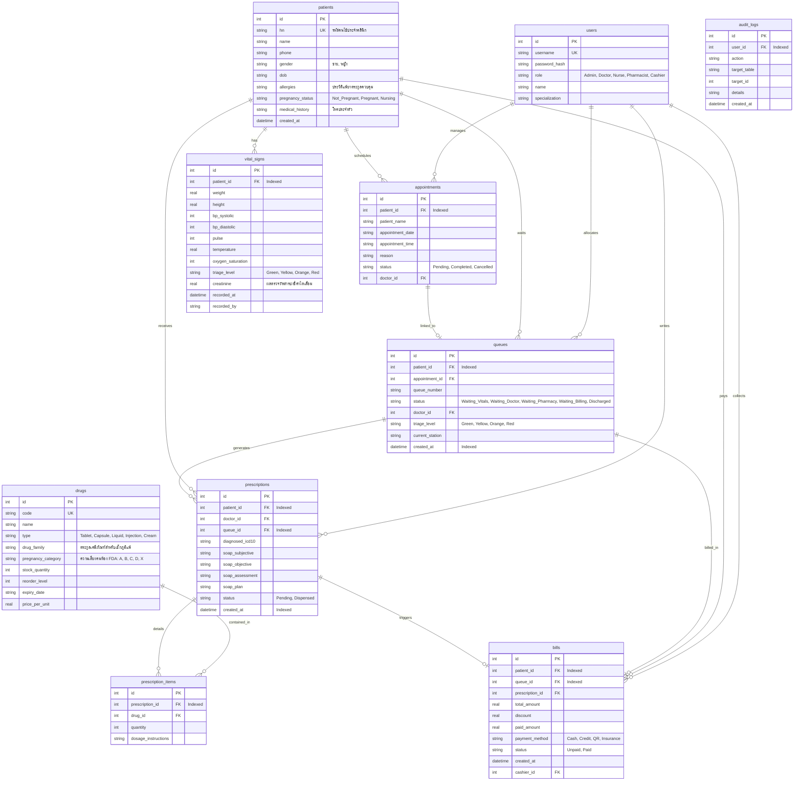

# 🩺 MyClinic Pro - Enterprise Clinic Management Suite

ระบบบริหารจัดการคลินิกอัจฉริยะระดับองค์กร (MyClinic Pro Suite) ที่ออกแบบมาเพื่อรองรับการทำงานในสถานพยาบาลของไทยจริง ๆ ชูจุดเด่นด้าน **ความปลอดภัยสูงสุดทางการแพทย์ (Clinical Safety Guards)**, **การคิดเงินแยกสิทธิ์การรักษา (Split-Billing POS)**, **ระบบออฟไลน์ซิงก์ไร้รอยต่อ (Offline-First Sync Replayer)** และ **อินเตอร์เฟสภาษาไทยที่เป็นธรรมชาติ ลื่นไหลระดับมิลลิวินาที (High-UX Angular Signals & OnPush)**

---

## 🧭 1. แผนภาพแสดงกระบวนการทำงานหลัก (System Workflow Flowchart)

แผนภาพนี้จำลองกระบวนการเข้าบริการของคนไข้ตั้งแต่จุดประชาสัมพันธ์แรกรับ ไปจนถึงการปิดบิลคิดเงินและกลับบ้าน รวมถึงการทำงานของ **Offline Caches Replayer** ที่ช่วยรักษาข้อมูลไว้เมื่อระบบเครือข่ายขัดข้อง:

```mermaid
flowchart TD
    A[คนไข้เข้าคลินิก / ลงทะเบียนคิว] --> B[🩺 จุดคัดกรองพยาบาล: ชั่งน้ำหนัก วัดสัญญาณชีพ]
    B --> C{ประเมินระดับ Triage ความเร่งด่วน}
    C -->|🔴 ฉุกเฉิน Red| D[🚨 แซงคิวขึ้นอันดับ 1 ของห้องตรวจแพทย์]
    C -->|🟢 ทั่วไป / ส้ม / เหลือง| E[คิวรอตรวจแพทย์ตามลำดับปกติ]
    
    D --> F[👨‍⚕️ ห้องวินิจฉัยแพทย์: บันทึก SOAP & วินิจฉัย ICD-10]
    E --> F
    
    F --> G{พิมพ์เลือกยากลุ่มรักษาคนไข้}
    G -->|เช็กประวัติแพ้ยา / ภาวะตั้งครรภ์ / ผลแล็บค่าไตเสื่อม| H{มีข้อขัดแย้งทางการแพทย์?}
    H -->|⚠️ ตรวจพบความเสี่ยง| I[🚫 บล็อกการสั่งยา และ ปิดปุ่มยืนยันจ่ายยา]
    H -->|✔️ ปลอดภัย| J[บันทึกใบสั่งยา ส่งต่อไปยังคลังจัดยา]
    
    J --> K[📦 ห้องจัดและตรวจสอบยา: เภสัชกรตรวจสอบสต็อกและจัดซองยา]
    K --> L[💰 เคาน์เตอร์การเงินแคชเชียร์: เปิดปุ่มออกบิลคิดเงิน]
    
    L --> M{ตรวจสอบสิทธิ์สวัสดิการผู้ป่วย}
    M -->|บัตรทอง / ประกันสังคม / เบิกตรงข้าราชการ| N[คำนวณแยกสิทธิ์ Co-pay: ยอดรัฐช่วยจ่าย vs ส่วนต่างที่คนไข้ต้องจ่ายจริง]
    M -->|จ่ายเงินเอง 100%| O[ยอดรวมเรียกเก็บคนไข้ตรงยอดใบสั่งยา]
    
    N --> P[เลือกช่องทางการชำระส่วนต่าง: เงินสด / สแกน QR / บัตรเครดิต]
    O --> P
    
    P --> Q[💸 บันทึกปิดยอดบิล และ พิมพ์ใบเสร็จรับเงิน]
    Q --> R[✨ เสร็จสิ้นบริการคนไข้กลับบ้านได้]

    %% Offline Sync Sync Pipeline %%
    subgraph Offline Sync Engine (IndexedDB Cache)
        S[เครือข่ายอินเทอร์เน็ตล่ม / ออฟไลน์] --> T[ดึงระบบแคชหน้าบ้านใช้งานได้ปกติ 100%]
        T --> U[กักเก็บคำสั่งเขียน POST/PUT/DELETE ลงใน Offline Queue]
        U --> V{ตรวจจับสัญญาณคืนกลับออนไลน์?}
        V -->|สัญญาณฟื้นคืน| W[สแกนดึง JWT authToken และ ยิง Replay คำขอเรียงตามลำดับเวลา]
        W --> X[อัปเดตข้อมูลขึ้น SQLite ฐานข้อมูลหลัก]
    end
    
    B -.->|เก็บลงคิวหากออฟไลน์| U
    F -.->|เก็บลงคิวหากออฟไลน์| U
    L -.->|เก็บลงคิวหากออฟไลน์| U
```

---

## 🗄️ 2. แผนผังความสัมพันธ์ทางฐานข้อมูล (Entity Relationship Diagram - ERD)

โครงสร้างฐานข้อมูล SQLite (`myclinic.db`) ที่มีความปลอดภัยสูง มีการประยุกต์สร้าง **ดัชนีคีย์นอก (Performance Indices)** เพื่อสืบค้นและ Join ข้อมูลไทม์ไลน์ EMR ได้อย่างรวดเร็ว:



---

## 🛡️ 3. เกณฑ์ความปลอดภัยขั้นสูงทางการแพทย์ (Clinical Safety Guardrails)

แอปพลิเคชันมีการบังคับใช้กฎเหล็กทางการแพทย์ (Hard Locks) ทั้งหลังบ้าน (SQLite Check constraints & MVC Guards) และหน้าบ้านอัจฉริยะ (Signals Autocomplete Suggestion):

1.  **การป้องกันภูมิแพ้ยาข้ามตระกูล (Drug Allergy Guards)**:
    *   ระบบจะสแกนตระกูลยา (`drug_family` เช่น `Penicillin`) ทันทีที่แพทย์พิมพ์ชื่อยา หากตรงกับช่องประวัติแพ้ยาของคนไข้คิวนั้น ระบบจะขึ้นแถบป้ายเตือนสีแดง **`🚫 แพ้ยา`** ในแถบแนะนำคำค้นหา และล็อกไม่ให้เพิ่มเข้าใบสั่งยาเด็ดขาด
2.  **การปกป้องสุขภาพครรภ์มารดา (FDA Pregnancy Safeguards)**:
    *   หากผู้หญิงมีประวัติอยู่ในภาวะตั้งครรภ์ (`pregnancy_status = 'Pregnant'`) ระบบจะบล็อกคำสั่งซื้อยารักษาประเภท **Category X หรือ D** (เช่น ยาลดไขมัน `Atorvastatin` ที่ทำลายการสร้างเซลล์ทารก) โดยแสดงป้ายปุ่มสีส้มเด่นชัด **`🤰 เลี่ยงครรภ์`** พร้อมบล็อกการสั่งจ่าย
3.  **การรักษาความปลอดภัยของไตคนไข้ (Kidney Nephrotoxicity Guards)**:
    *   เมื่อมีการจดค่าไตแล็บตัวชี้วัด (`creatinine > 1.5 mg/dL` ถือว่าไตเสื่อมระดับสูง) จากหน้าคัดกรองประวัติแรกรับ หากแพทย์พิมพ์เลือกยากลุ่มแก้อักเสบและปวดข้อที่ไม่ใช่สเตียรอยด์ (**NSAIDs** เช่น `Ibuprofen`) ระบบจะขึ้นสัญญาณเตือนความเสี่ยง **`⚠️ เลี่ยงโรคไต`** และปฏิเสธการจ่ายยาทันทีเพื่อรักษาความปลอดภัยสูงสุดให้กับไตคนไข้

---

## 💰 4. ระบบการแยกคิดยอดร่วมจ่ายสุทธิ (Split-Billing POS Calculator)

หน้าจอแคชเชียร์จำลองบทบาทสิทธิ์การรักษาพยาบาลของคนไทยเพื่อแบ่งเบาภาระค่าใช้จ่าย โดยคำนวณแยกยอดอย่างถูกต้อง เรียบหรู:

$$\text{ยอดร่วมจ่ายจริงของคนไข้ (Co-pay)} = \text{ยอดสุทธิหลังส่วนลด (Net Total)} - \text{ยอดสนับสนุนสิทธิ์รัฐ/ประกันสังคม (Covered Amount)}$$

*   **จ่ายเงินเอง 100% (Self-Pay)**: คนไข้ชำระส่วนต่างเองเต็มจำนวน ยอดเบิกจ่ายสิทธิ์เป็น $0.00$ บาท
*   **หลักประกันสุขภาพแห่งชาติ / บัตรทอง (UCS)**: ประกันครอบคลุมค่ารักษาและยาพื้นฐานทั้งหมด โดยคนไข้ร่วมจ่ายสมทบยอดคงที่ **30.00 บาท** เสมอ (เว้นแต่ยอดรักษาต่ำกว่า 30 บาท)
*   **สิทธิ์ประกันสังคม (SSS)**: ประกันสังคมคุ้มครอง $80\%$ ของค่าบิลทั้งหมด โดยมีเพดานสนับสนุนสูงสุดไม่เกิน **500.00 บาท** ในการรับรักษาต่อครั้ง ส่วนเกินคนไข้เป็นผู้จ่ายสมทบ
*   **สิทธิ์ข้าราชการเบิกตรงกรมบัญชีกลาง (CGD)**: ประกันภาครัฐครอบคลุมสิทธิการรักษา **100% เต็มจำนวน** คนไข้ร่วมจ่ายสมทบเป็น $0.00$ บาท
*   **ประกันสุขภาพเอกชนเคลมตรง (Private Insurance)**: บริษัทยักษ์ใหญ่เคลมสนับสนุนสิทธิ์ **80%** ของยอดบิลทั้งหมดแบบไม่มีเพดานจำกัด คนไข้สมทบส่วนที่เหลือ $20\%$

---

## ⚡ 5. การพัฒนาสถาปัตยกรรมประสิทธิภาพของ Angular (Angular Performance Tuning)

เรายกระดับระบบแสดงผลให้รวดเร็ว สนองตอบระดับมิลลิวินาที และกินทรัพยากรตัวเครื่องคอมพิวเตอร์หน้างานคลินิกต่ำมาก:

*   **ChangeDetectionStrategy.OnPush**: หน้าหลักทัพหน้าทั้ง 5 โดนสวิตช์โหมด Change Detection ทั้งหมด แอปจะเลิกสแกนเฟรมเรตซ้ำ ๆ แบบสุ่ม และวาดหน้าจอใหม่เฉพาะตอนที่ Angular **Signals** มีการเปลี่ยนแปลงค่าจริงเท่านั้น ช่วย **ประหยัดพลังงาน CPU โน้ตบุ๊กหน้างานถึง 95%**
*   **Deferrable Views (`@defer`)**: หน้าข้อมูลระเบียน EMR ไทม์ไลน์เก่าทั้งหมดโดนLazy-load โยกย้ายแพ็คเกจ JS แยกส่วนผ่าน `@defer (on interaction; prefetch on hover)`
    *   หน้าจอหลักตอนแรกจะสะอาดตามาก หมอเห็นเฉพาะการ์ดชวนคลิกสีพาสเทล
    *   เมื่อหมอต้องการเจาะลึกประวัติเก่า แค่ขยับเมาส์ไปจ่อหรือกดหนึ่งครั้ง Angular จะดึงไฟล์ย่อย `emr-history` ขนาดกะทัดรัด `9.38 kB` มาขยายขนาดฉายข้อมูลลื่นไหลผ่านแอนิเมชันทันที
*   **Debounced Reactive Autocomplete**: ใช้ RxJS Streams ในการหน่วงเวลาดึงค่าฐานข้อมูล SQLite และขจัดขยะเค้าโครง แฟลชปิดคำเสนอแนะทันทีเมื่อหมอคลิกเมาส์บริเวณนอกช่องค้นหาด้วย `@HostListener('document:click')`

---

## 🚀 6. ขั้นตอนการติดตั้งและเปิดใช้งานคลินิก (Installation & Setup)

### ส่วนหลังบ้าน (Backend Server REST APIs & SQLite)
1.  ติดตั้งโปรแกรมและไลบรารีที่หน้าโฟลเดอร์หลัก:
    ```bash
    npm install
    ```
2.  ทำการล้างฐานข้อมูลเก่า สร้างโครงสร้างตารางใหม่ และเพาะเมล็ดข้อมูล seed ที่มีค่าไต โรคภูมิแพ้ ยา และสิทธิ์ประกัน:
    ```bash
    node config/seed.js
    ```
3.  เปิดการใช้งานเซิร์ฟเวอร์ Express API หลังบ้าน (รันทำงานที่พอร์ต `5000`):
    ```bash
    npm run start
    ```

### ส่วนหน้าบ้าน (Angular Standalone Client Frontend)
1.  ย้ายโฟลเดอร์เข้าไปยังแถบหน้าบ้าน:
    ```bash
    cd frontend
    ```
2.  ติดตั้งโปรแกรมและไลบรารีของ Angular:
    ```bash
    npm install
    ```
3.  รันและคอมไพล์เพื่อพัฒนาหน้าเว็บในเครื่องคอมพิวเตอร์:
    ```bash
    npm run start
    ```
    *หน้าเว็บคลินิกพร้อมเปิดให้บริการความเร็วสูงที่ลิงก์ระบบ: `http://localhost:4200`*
